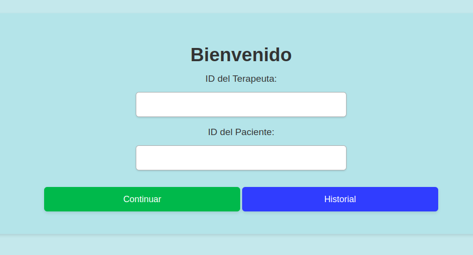
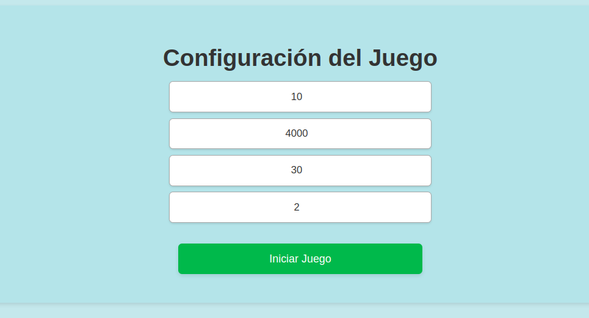
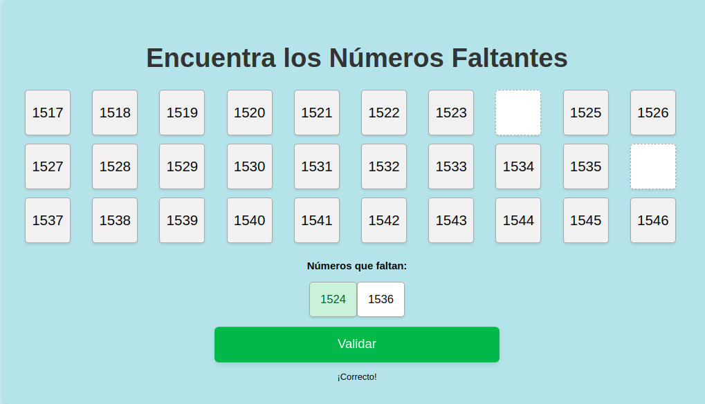
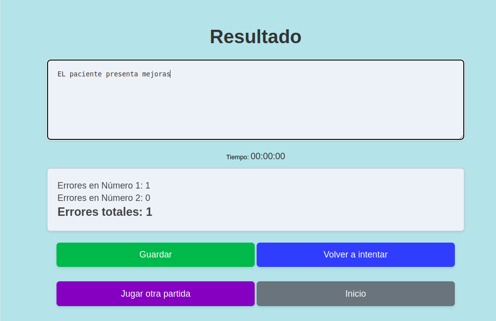

# 🧩 Juego de Secuencias Numéricas

¡Bienvenido al **Juego de Secuencias Numéricas**! Este proyecto está diseñado para ayudar a los usuarios a trabajar con secuencias y encontrar números faltantes, sirviendo como una herramienta lúdica y educativa.

## 📋 Tabla de Contenidos
- [Descripción del Proyecto](#descripcion-del-proyecto)
- [Tecnologías Utilizadas](#tecnologias-utilizadas)
- [Instalación](#instalacion)
- [Uso del Proyecto](#uso-del-proyecto)
- [Archivos y Estructura](#archivos-y-estructura)
- [Estilo Visual](#estilo-visual)
- [Autor](#autor)

## 📖 Descripción del Proyecto 
Este proyecto está orientado a permitir que los usuarios practiquen la identificación de patrones numéricos. Consiste en un juego donde los usuarios deben encontrar números que faltan en una secuencia numérica generada aleatoriamente. Está pensado para mejorar la agilidad mental y ayudar a terapeutas a usarlo como una herramienta terapéutica.

## 🚀 Tecnologías Utilizadas 
- **HTML5**: Estructuración del contenido.
- **CSS3**: Estilización de la interfaz para hacerla más atractiva y moderna.
- **JavaScript**: Lógica del juego y gestión de la interfaz de usuario.

## 🛠 Instalación 
Para utilizar este proyecto, simplemente sigue estos pasos:

1. Abre el archivo `login.html` en tu navegador favorito para comenzar.

## 🎮 Uso del Proyecto 
1. **Pantalla de Login**: 
   - Ingresa el ID del terapeuta y el ID del paciente. Haz clic en **Continuar** para ir a la configuración del juego.
   - También puedes revisar el historial haciendo clic en **Historial**.

   

2. **Configuración del Juego**:
   - Selecciona el rango de números, la longitud de la secuencia, y la cantidad de números que deseas encontrar.
   - Haz clic en **Iniciar Juego**.

   

3. **Pantalla de Juego**:
   - Encuentra los números que faltan en la secuencia. Los inputs se habilitarán uno por uno a medida que completes correctamente cada número.
   - Haz clic en **Validar** para comprobar cada respuesta.

   

4. **Pantalla de Resultados**:
   - Al finalizar el juego, se muestra un resumen de los errores cometidos y una caja de texto para observaciones.
   - Puedes **Guardar** el resultado, volver a intentar o comenzar una nueva partida.

   

## 📂 Archivos y Estructura 
### Estructura de Archivos
- **login.html**: Página principal donde se ingresan los IDs de usuario.
- **login.js**: Lógica del inicio de sesión y almacenamiento de IDs.
- **config.html**: Configuración del juego donde se define el rango y los números faltantes.
- **config.js**: Lógica para almacenar configuraciones y empezar el juego.
- **game.html**: Página del juego que muestra la secuencia de números y permite completar los faltantes.
- **game.js**: Lógica del juego, generación de la secuencia, y validación de los inputs.
- **result.html**: Página de resultados para ver los errores y agregar observaciones.
- **result.js**: Manejo del resumen de errores y las opciones de finalizar o reiniciar el juego.
- **style.css**: Estilos compartidos para todas las páginas del proyecto.

## Archivos y Estructura

Este proyecto tiene la siguiente estructura de archivos y carpetas:

proyecto-de-secuencias
  - .vscode/
  - img/
    - config.png
    - game.png
    - Login.png
    - Resultado.png
  - config.html
  - config.js
  - game.html
  - game.js
  - history.html
  - history.js
  - login.html
  - login.js
  - README.md
  - result.html
  - result.js
  - style.css

### Descripción de Archivos:

- .vscode/: Carpeta con configuraciones específicas del editor Visual Studio Code.
- img/: Contiene imágenes utilizadas en el proyecto.
  - config.png: Imagen representativa de la configuración del juego.
  - game.png: Imagen de la pantalla del juego.
  - Login.png: Imagen de la pantalla de inicio de sesión.
  - Resultado.png: Imagen que muestra la pantalla de resultados.
- config.html: Página donde se configuran los parámetros del juego antes de iniciarlo.
- config.js: Lógica para gestionar las configuraciones del juego y pasar los datos necesarios.
- game.html: Página principal del juego donde se muestra la secuencia y los inputs.
- game.js: Lógica del juego, generación de la secuencia y validación de los números.
- history.html: Página que muestra el historial de partidas.
- history.js: Lógica para manejar el historial de partidas jugadas.
- login.html: Página de inicio de sesión para ingresar los IDs de terapeuta y paciente.
- login.js: Lógica que gestiona el inicio de sesión y validación de IDs.
- README.md: Documento que contiene la descripción y documentación del proyecto.
- result.html: Página que muestra el resumen de resultados luego de una partida.
- result.js: Lógica para gestionar los resultados, errores y observaciones al final del juego.
- style.css: Archivo CSS que contiene los estilos compartidos para las diferentes páginas del proyecto.

Esta estructura ofrece una visión clara de cómo se organizan los diferentes componentes del proyecto y cuál es la función de cada uno de los archivos.

## 🌟 Estilo Visual 
Para hacer que el juego sea más atractivo y divertido, se ha usado CSS para crear un diseño limpio y amigable. Cada botón tiene colores llamativos para guiar intuitivamente al usuario en la experiencia del juego. A continuación, algunos ejemplos de estilo:

## 🤖 Desarrollado por Vertex Quality
Este proyecto fue creado con pasión por **Vertex Quality** 🌀, buscando aportar diversión y aprendizaje a través de la práctica de secuencias numéricas. 

¿Tienes alguna idea o simplemente quieres decir hola? 🌟
¡No dudes en contactarnos! 📧 [contact@vertexquality.com](mailto:contact@vertexquality.com)

